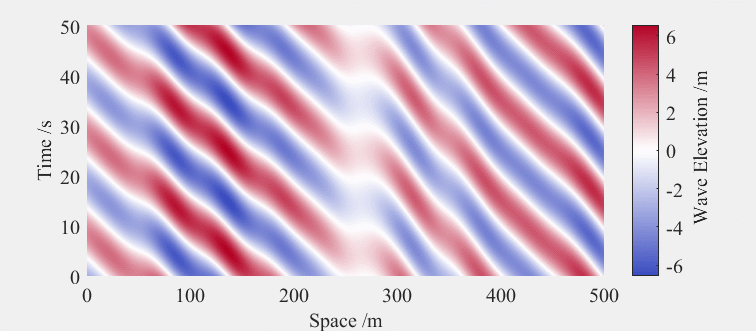
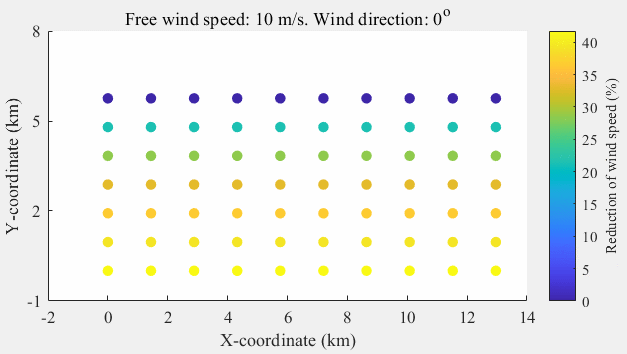

# LoFT v 1.0

  LoFT presents a Low-order modelling of floating offshore wind turbines (FOWTs). The main purposes are threefold:
1. Enable the low-order modelling and fast simulations of numerous FOWTs.
2. Faciliate the application of deep reinforcement learning in floating offshore wind farms.
3. Present a fair comparison between different low-order modelling of FOWTs (to be released).


## Brief Summary
   The basic motivation behind LoFT is to provide a tool to facliate the application of deep reinforcement learning in floating offshore wind farms. To achieve this, we need to put computational efficiency in the first place since deep reinforcement learning needs to interact with the environment for over millions of times. As a result, LoFT  only reservs the degrees of freedom that notabley influence the power output of FOWTs. Moreover, LoFT supports **_domain randomization_** , which is considered as the key source of robustness of a deep reinforcement learing scheme to tranfer from simulations to the real world, as shown in Fig.1.

 <div align=center>
       
</div>
 <div align=center>
      Fig.1 Illustration of domain randomization in a floating wind farm, with changing wind field and wave field
</div>

<br/>
In the future development, the coupling between platform motions and wake effect will be considered.

## Quick Use
run '[Example1.m](Example1.m)' to change environment settings and simulate 5 FOWTs.

run '[Example2.m](Example2.m)' to simulate 70 FOWTs considering wake effect and wave field coherence.

run '[Compare.m](Validation/Compare.m)'  to see the validation of LoFT against OpenFast.

## Project organization
- PG = project-generated
- HW = human-writable
- RO = read only
```
.
├── .gitignore
├── LICENSE.md
├── README.md
├── Function                    <- All project functions (HW)  
├── Param                       <- All project parameters
│   ├── IEA 15 MW               <- The final, canonical data sets for modeling. (RO)
│   ├── IEA 22 MW               <- The original, immutable data dump. (RO)
├── Simulink                    <- Simulink models (HW)
├── Results         
│   └── figures                 <- Figures for the manuscript or documentation (PG)
├── TurboPark                   <- Averaged wind field modelling (HW)
├── Validation                  <- Validation against OpenFast (PG) 


```
## Credit

"Primary Frequency Response of Floating Offshore Wind Turbines via Deep Reinforcement Learning and Domain Randomization", submitted to IEEE Transactions on Sustainable Energy. [Mingyang Mei](https://scholar.google.com/citations?user=jpXmO2UAAAAJ&hl=zh-CN), Peng Kou,  [Zhihao Zhang](https://scholar.google.com/citations?hl=zh-CN&user=Qfr4gA4AAAAJ), [Yuanhang Zhang](https://scholar.google.com/citations?hl=zh-CN&user=Qfr4gA4AAAAJ), Zhihang Xue, Deliang Liang (Corresponding author: [Peng Kou](https://gr.xjtu.edu.cn/en/web/koupeng))

## License
This project is licensed under the terms of the [Apache License Version 2.0](/LICENSE.md)
