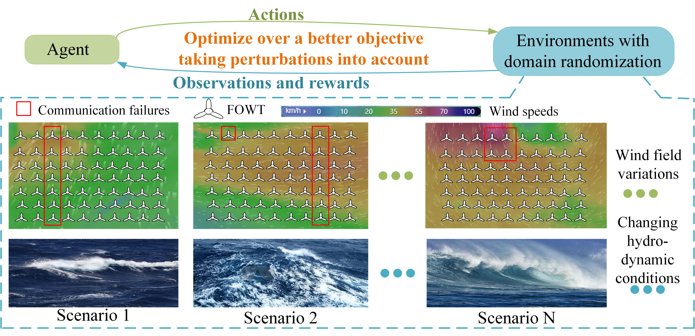

# LoFT v 1.0

  LoFT presents a Low-order modelling of floating offshore wind turbines (FOWTs)/ farms. The main purposes are threefold:
1. Establish the low-order modelling and fast simulations of numerous FOWTs.
2. Faciliate the grid intergration research in floating offshore wind farms.
3. Support the deep reinforcement learning training 


## Brief Summary
   The basic motivation behind LoFT is to provide a tool to support the grid intergration research of floating offshore wind farms. To achieve this, we need to put computational efficiency in the first place since the grid intergration research requires simulating large amounts of FOWTs. As a result, LoFT  only reservs the degrees of freedom that notabley influence the power output of FOWTs. 
   
   
   Moreover, another purpose of LoFT is to support the deep reinforcement learning training. To achieve this, LoFT introduces **_domain randomization_** , which is considered as the key source of robustness of a deep reinforcement learing scheme to tranfer from simulations to the real world, as shown in Fig.1. Specifically, instead of repeating a certain scenario,
 domain randomization diversifies the simulation by imposing  as many sets of scenarios as possible. In this way, the domain of the simulated dynamics is enlarged so that it can fully cover the real dynamics, and the resilience of a DRL scheme against challenging environments and model mismatch is improved. Through domain randomization, the trained agent is able to generaliza to full-order models in [OpenFast/Fast.Farm](https://github.com/OpenFAST), or even the real-world wind farm

<div align=center>
      
</div>

<!-- your comment goes here <div align=center>
       
</div>-->
<div align=center>
       
</div>
<div align=center>
      Fig.1 Illustration of domain randomization in a floating wind farm, with changing wave fields and wind fields
</div>

In the future development, the coupling between platform motions and wake effect will be considered.

## Quick Use
run '[Example1.m](Example1.m)' to change environment settings and simulate 5 FOWTs.

run '[Example2.m](Example2.m)' to simulate 70 FOWTs considering wake effect and wave field coherence.

run '[Compare.m](Validation/compare.m)'  to see the validation of LoFT against OpenFast.

Please refer to '[Documentation.pdf](Documentation.pdf)' for more details.

## Project Organization
- PG = project-generated
- HW = human-writable
- RO = read only
```
.
├── .gitignore
├── LICENSE.md
├── README.md
├── Function                    <- All project functions (HW)  
├── Param                       <- All project parameters
│   ├── IEA 15 MW               <- IEA 15 MW semi-submersible FOWT parameters. (RO)
│   ├── IEA 22 MW               <- IEA 22 MW semi-submersible FOWT parameters. (RO)
├── Simulink                    <- Simulink models (HW)
├── Results         
│   └── figures                 <- Figures for the manuscript or documentation (PG)
├── TurboPark                   <- Averaged wind field modelling (HW)
├── Validation                  <- Validation against OpenFast (PG) 


```
## Credit

"Primary Frequency Response of Floating Offshore Wind Turbines via Deep Reinforcement Learning and Domain Randomization", submitted to IEEE Transactions on Sustainable Energy. [Mingyang Mei](https://scholar.google.com/citations?user=jpXmO2UAAAAJ&hl=zh-CN), Peng Kou,  [Zhihao Zhang](https://scholar.google.com/citations?hl=zh-CN&user=Qfr4gA4AAAAJ), [Yuanhang Zhang](https://scholar.google.com/citations?hl=zh-CN&user=1cSO8eAAAAAJ), Zhihang Xue, Deliang Liang (Corresponding author: [Peng Kou](https://gr.xjtu.edu.cn/en/web/koupeng))

## License
This project is licensed under the terms of the [Apache License Version 2.0](LICENSE.txt)
